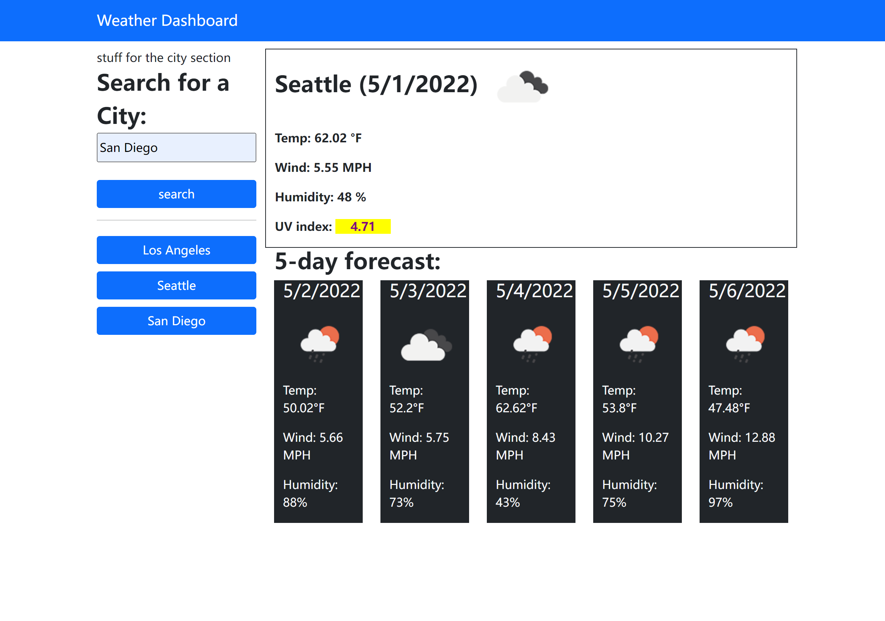

# UCSD_HW6_Weather-Dashboard
Third-party APIs allow developers to access their data and functionality by making requests with specific parameters to a URL. Developers are often tasked with retrieving data from another application's API and using it in the context of their own. The challenge here is to build a weather dashboard that will run in the browser and feature dynamically updated HTML and CSS.

## User Story

```
AS A traveler
I WANT to see the weather outlook for multiple cities
SO THAT I can plan a trip accordingly
```

## Link to this Dashboard.
* Click to use this Weather Dashboard: [Convenient tool!](https://hengyu89.github.io/UCSD_HW6_Weather-Dashboard/)

## What I've done

* The user could type the name of cities you want to know the current and future 5 days weathers information. Like "San Diego".

* Once you type the city and click "search", you will see the display of weather information on the right side.

* In the meantime you click the "search", there will occur a "history" button which stores your history search, then you could quickly click this "history" button to see the weather instead of typing the city name again.

* The weather information includes: city name, the date, an icon representation of weather conditions, the temperature, the humidity, the wind speed, and the UV index 

## Screenshot:

